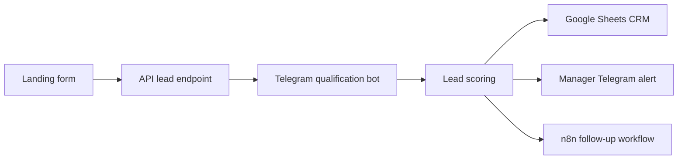

# Architecture

## Main Services

- Landing app: public entry point.
- API: validation, routing, RAG lookup, and webhook handling.
- Telegram bot: conversational qualification with 6 questions.
- Scoring: hot/warm/cold priority and next action.
- CRM: local CSV/JSON fallback now, Google Sheets target for n8n.
- n8n: duplicate checks, Google Sheets append, Telegram alerts, reminders, and workflow visibility.

## Current Local Endpoints

- `GET /api/health`
- `POST /api/lead`
- `POST /api/telegram`
- `POST /api/rag`
