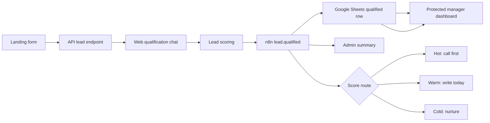

# Architecture

## Main Services

- Landing app: public entry point.
- API: validation, routing, RAG lookup, and webhook handling.
- Web qualification chat: conversational qualification with 6 questions.
- Telegram bot: optional alternate qualification channel and manager notification transport.
- Scoring: hot/warm/cold priority and next action.
- CRM: local CSV/JSON fallback now, Google Sheets target for n8n.
- Manager dashboard: password-protected local operations view powered by `/api/leads`.
- n8n: duplicate checks, Google Sheets append, Telegram alerts, reminders, and workflow visibility.
- Event model: `lead.qualified` for the main web flow; `lead.created` remains available for fallback intake tests.
- Event identity: each webhook includes `eventId` and `emittedAt` for duplicate protection and audit trails.

## Current Local Endpoints

- `GET /api/health`
- `POST /api/lead`
- `POST /api/lead/qualify`
- `POST /api/telegram`
- `POST /api/rag`
- `GET /api/admin/session`
- `POST /api/admin/login`
- `POST /api/admin/logout`
- `GET /api/leads`
